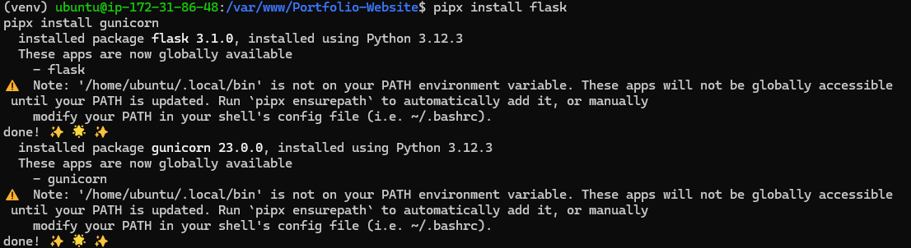

# Setting Up Local Deployment of Portfolio Website, and Cloud Deployment

### Table of Contents
1. Local Deployment
2. Cloud Deployment

## Introduction
In this report, we will be deploying our Portfolio Website locally and to the cloud using Caddy and Gunicorn. Gunicorn is WSGI HTTP Server specially used to run python web applications. We are going to use Gunicorn since:
- It handles multiple requests efficiently
- It is more stable and restarts on failure
- Has overall better performance than Flask's built-in server

### Local Deployment
1. Install Caddy on Ubuntu
```ubuntu
sudo apt install -y debian-keyring debian-archive-keyring apt-transport-https curl
curl -1sLf 'https://dl.cloudsmith.io/public/caddy/stable/gpg.key' | sudo gpg --dearmor -o /usr/share/keyrings/caddy-stable-archive-keyring.gpg
curl -1sLf 'https://dl.cloudsmith.io/public/caddy/stable/debian.deb.txt' | sudo tee /etc/apt/sources.list.d/caddy-stable.list
sudo apt update
sudo apt install caddy
```


Check if caddy has been installed with: 
```ubuntu
caddy version
```


2. Git clone Portfolio Application
```
git clone https://github.com/justinkimchi1/Portfolio-Website.git
```

3. Move Portfolio Application to /var/www directory
```
sudo mv Portfolio-Website /var/www
```

4. Set up a Virtual Environment
> This will keep our project dependencies separate ensuring that we don't create conflict with other projects. 
```
cd /var/www/Portfolio-Website
python3 -m venv venv
source venv/bin/activate
```

5. Installing `pipx`
> Ubuntu prevents modifying system-managed python packages. `pipx` will install packages in an isolated environment
```
sudo apt install pipx
pipx ensurepath
```

6. Installing `flask` and `gunicorn` with `pipx`
```
pipx install flask
pipx install gunicorn
```
> Your screen should look something like this after it is finished installing


7. Give /var/www/Portfolio-Website proper permissions so that it is accessible
```
sudo chown -R $USER:$USER /var/www/Portfolio-Website
chmod -R 755 /var/www/Portfolio-Website
```