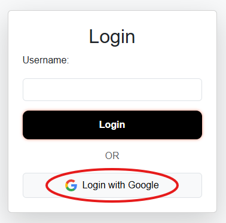

# Local Portfolio Setup/Deployment and Cloud Deployment in Caddy

### Table of Contents
1. Local Deployment
2. Cloud Deployment

## Introduction
In this report we will be deploying our Portfolio Website first locally on our device and then deploy it to the cloud in the second part.

### Local Deployment
1. Go to Caddy's Github and install the right version for your device


2. Extract the files and move caddy.exe into a new directory at `C:/Windows/System32`


3. Add Caddy as an Environmental Variable
- Open settings and go to System -> About
- Click Advanced system settings

- Click Environmental Variables

- Select Path and Click edit
  
- Click New and right your path to Caddy.exe


4. Run `caddy version` and `caddy run` to test it is working


5. Create a Caddyfile in your Portfolio website application directory and have this configuration:
```nginx
localhost {
    reverse_proxy 127.0.0.1:5000
}
```
Configurations:
- `localhost` - Specifies the local machine (our device)
- `reverse_proxy` - Specify that we want to use a proxy to handle incoming requests
- `127.0.0.1` - Specifies our local machine 
- `:5000` - This is the port number where our proxy is listening

6. In powershell, cd into your Portfolio Website application directory and run your app


7. In another powershell terminal cd into your Portfolio Website application directory and run this command:
```
caddy run
```
This will start your the Caddy reverse proxy


We have finished setting up a reverse proxy for our Portfolio Website.

 In summary, we have set up a reverse proxy server on Caddy that will handle and recieve all the HTTP requests on our `localhost:5000` port and will forward them to our Flask Application. While we are not running our Flask Application directly on the Caddy Server, we are still processing the requests and returning the responses back through the Caddy proxy, leveraging Caddy's powerful SSL/TLS termination features.


 ### Cloud Deployment
 1. Install `pip` and `venv`
 ```bash
sudo apt install python3 python3-pip python3-venv -y
 ```
 We will use `pip` to install flask and flask-session which are needed to run our flask application. We will use `venv` to create a virtual environment where we install our project dependencies and keep them separate from other projects.

 2. Install Caddy
 ```bash
sudo apt install -y debian-keyring debian-archive-keyring apt-transport-https curl
curl -1sLf 'https://dl.cloudsmith.io/public/caddy/stable/gpg.key' | sudo gpg --dearmor -o /usr/share/keyrings/caddy-stable-archive-keyring.gpg
curl -1sLf 'https://dl.cloudsmith.io/public/caddy/stable/debian.deb.txt' | sudo tee /etc/apt/sources.list.d/caddy-stable.list
sudo apt update
sudo apt install caddy
 ```


Check if caddy has been installed with: 
```bash
caddy version
```


3. Install Gunicorn
```bash
sudo apt install gunicorn -y
```
Gunicorn is WSGI HTTP Server specially used to run python web applications. We are going to use Gunicorn since:
- It handles multiple requests efficiently
- It is more stable and restarts on failure
- Has overall better performance than Flask's built-in server

4. Git clone project and give directory the correct permissions
```bash
git clone https://github.com/justinkimchi1/Portfolio-Website.git
sudo mv Portfolio-Website /var/www
sudo chown -R ubuntu:ubuntu /var/www/Portfolio-Website
cd /var/www/Portfolio-Website
```

5. Set up the virtual environment
```bash
python3 -m venv venv
source venv/bin/activate
```
> You will know if the virtual environment is active if you see `(venv)` in the terminal

6. `pip` install `flask` and `gunicorn`
```bash
pip install flask gunicorn
```

7. Create a `wsgi.py` file and add the following content to run our application
```bash
nano /var/www/Portfolio-Website/wsgi.py
```

Content:
```python
from app.routes import app

if __name__ == '__main__':
    app.run()
```

8. Creating a systemd service for Gunicorn

This will help us manage our application in several ways: 
- It will run automatically when the server boots up
- `systemd` automatically monitors the health of our application and provides us logs, helping us troubleshoot problems
- Simplifies our commands to stop, start, restart, and enable our application

```bash
sudo nano /etc/systemd/system/portfolio.service
```
Following content:
```ini
[Unit]
Description=Flask Portfolio App
After=network.target

[Service]
User=www-data
WorkingDirectory=/var/www/Portfolio-Website
Environment="PATH=/var/www/Portfolio-Website/venv/bin"
ExecStart=/var/www/Portfolio-Website/venv/bin/gunicorn --workers 3 --bind unix:portfolio.sock -m 007 wsgi:app

[Install]
WantedBy=multi-user.target
```
- `After=network.target` - Tells the service to start after we connect to the network target
- `User=www-data` - Tells our service to use `www-data` which is a common user used to run web applications
- `WorkingDirectory=/var/www/Portfolio-Website` - Specifies the working directory of our Porfolio directory
- `Environment="PATH=/var/www/Portfolio-Website/venv/bin"` - Sets the environmental variables for the service, which is specified as the virtual environment of our Portfolio directory
- `ExecStart=/var/www/Portfolio-Website/venv/bin/gunicorn --workers 3 --bind unix:portfolio.sock -m 007 wsgi:app` - This is the command that starts the service. Here we: 
    - Set the number of worker processes to 3 
    - Bind Gunicorn to a UNIX socket
    - Set the unmask process for Gunicorn process
    - Specify our wsgi entry point (our wsgi.py file that we made in the earlier steps) 
- `WantedBy=multi-user.target` - Tells our service to start running when our service reaches 'multi-user target' state, which is a typically state to run most services

9. Start and Enable the service
```bash
sudo systemctl daemon-reload
sudo systemctl start portfolio
sudo systemctl enable portfolio
```

10. Get your public ip of your ec2 instance and update the DNS record of your route 53 host zone


Configure the DNS Record as the following:


Check if the connection worked with this command:
```bash
dig <website-name>
```
> Your output should show your ec2's public IP address


11. Configure Caddyfile
```caddyfile
portfolio.play.jkimchi.site {
    handle /static/* {
        root * /var/www/Portfolio-Website/app
        file_server
    }

    @notStatic {
        not path /static/*
    }
    reverse_proxy @notStatic unix//var/www/Portfolio-Website/portfolio.sock
}
```

12. Restart the service
```bash
sudo systemctl restart caddy
```

13. Verify that your HTTPS connection works by visiting the site
```
https://portfolio.play.jkimchi.site
```

Make sure your ec2 instance allows inbound traffic from HTTP and HTTPS
1. Go to EC2 dashboard and select your instance
2. Click on the security groups affliated with your instance and edit inbound rules
3. Add two rules, one for HTTP and one for HTTPS
4. Allow the `Anywhere-IPv4` option and press save changes

Congratulations you have successfully deployed your Portfolio Website to your cloud instance!

## Demo of Successful Deployment
Click on video

[](https://youtu.be/gRTTvwD1A4Q)


### Troubleshooting
**Common problems:**

#### Domain Not Resolving to the EC2 Instance
- `dig <domain-name>` does not return the EC2 instance's IP.
- Causes: Incorrect DNS configuration in Route 53 and/or DNS propagation delay.

Steps to fix:
1. Verify the A Record in Route 53:
- Go to the Route 53 dashboard.
- Ensure the A record for play.jkimchi.site points to the correct public IP of your EC2 instance.

2. Check DNS Propagation:
- Use a tool like DNS Checker to verify the domain resolves to the correct IP globally.
- If the domain does not resolve, wait a few minutes and check again (DNS changes can take up to 24 hours to propagate, but usually it's faster).

3. Flush Local DNS Cache:
- On your local machine, flush the DNS cache to ensure you're not seeing stale results:
    - Run `ipconfig /flushdns`

#### Caddy Fails to Obtain an SSL Certificate
- The site does not load over HTTPS.
- Causes: Ports `80` (HTTP) and `443` (HTTPS) are not open in the EC2 security group or the domain does not resolve to the EC2 instance.

Steps to fix:
1. Check Security Group Rules:
- Look at bottom part of Step 13

2. Verify Domain Resolution:
- Ensure the domain resolves to the EC2 instance's IP: `dig <domain-name>`

3. Check Caddy Logs:
- Inspect Caddy logs for detailed error messages: `sudo journalctl -u caddy --no-pager | less`

#### Static Files Not Loading
- The HTML page loads, but CSS, JavaScript, or images are missing. 
- Browser console shows 404 Not Found for static files.
- Causes: Incorrect `root` path in the Caddyfile or Incorrect file permissions for the `static` directory.

Steps to fix:
1. Verify the Caddyfile:
- Ensure the root directive points to the correct directory: 
```bash
handle /static/* {
    root * /var/www/Portfolio-Website/app
    file_server
}
```

2. Check File Permissions:
- Ensure the `static` directory and its contents are readable by Caddy: 
```bash
sudo chown -R www-data:www-data /var/www/Portfolio-Website/app/static
sudo chmod -R 755 /var/www/Portfolio-Website/app/static
```

3. Test Static File Access:
- Manually access a static file in your browser: 
```
https://<domain-name>/static/css/styles.css
```

## Part 2 of Project: HAProxy, Reverse Proxy, OAuth Implementation, Github Widget Integration, Scalability & Performance Results

### Quick Overview:

This project outlines the infrastructure setup for a highly available, scalable, and secure deployment of my personal portfolio website: https://portfolio.play.jkimchi.site. The application is a Flask web app served through Gunicorn, reverse-proxied by Caddy, and deployed using a multi-layered approach including HAProxy, Nginx, and AWS EC2 instances.

### HAProxy and Reverse Proxy Setup
Infrastructure Diagram:
```
Browser
   |
   |  HTTPS (443)
   v
[HAProxy - Load Balancer]
   |  HTTP (80)
   v
[Nginx Reverse Proxies x2]
   |  HTTP (5000)
   v
[Caddy → Gunicorn → Flask App]
```

This part of the project focused on configuring a full load-balanced setup. HAProxy was used to receive incoming HTTPS requests, terminate SSL, and forward traffic to two Nginx reverse proxy servers. The Nginx servers then forward these requests to the backend application.

This multi-tiered setup allows the backend application to remain isolated and protected, while also providing load distribution and failure recovery.

### HAProxy Configuration

The following HAProxy configuration sets up both HTTP and HTTPS frontends. The HTTPS frontend is bound to port 443 and uses a certificate generated by Certbot. It forwards requests to the backend defined as nginx_nodes, which load balances traffic across the two Nginx servers.

```bash
global
        log /dev/log    local0
        log /dev/log    local1 notice
        chroot /var/lib/haproxy
        stats socket /run/haproxy/admin.sock mode 660 level admin
        stats timeout 30s
        user haproxy
        group haproxy
        daemon

        # Default SSL material locations
        ca-base /etc/ssl/certs
        crt-base /etc/ssl/private

        # See: https://ssl-config.mozilla.org/#server=haproxy&server-version=2.0.3&config=intermediate
        ssl-default-bind-ciphers ECDHE-ECDSA-AES128-GCM-SHA256:ECDHE-RSA-AES128-GCM-SHA256:ECDHE-ECDSA-AES256-GCM-SHA384:ECDHE-RSA-AES256-GCM-SHA384:ECDHE-ECDSA-CHACHA20-POLY1305:ECDHE-RSA-CHACHA20-POLY1305:D>        ssl-default-bind-ciphersuites TLS_AES_128_GCM_SHA256:TLS_AES_256_GCM_SHA384:TLS_CHACHA20_POLY1305_SHA256
        ssl-default-bind-options ssl-min-ver TLSv1.2 no-tls-tickets

defaults
        log     global
        mode    http
        option  httplog
        option  dontlognull
        timeout connect 5000
        timeout client  50000
        timeout server  50000
        errorfile 400 /etc/haproxy/errors/400.http
        errorfile 403 /etc/haproxy/errors/403.http
        errorfile 408 /etc/haproxy/errors/408.http
        errorfile 500 /etc/haproxy/errors/500.http
        errorfile 502 /etc/haproxy/errors/502.http
        errorfile 503 /etc/haproxy/errors/503.http
        errorfile 504 /etc/haproxy/errors/504.http


frontend https_front
    bind *:443 ssl crt /etc/letsencrypt/live/portfolio.play.jkimchi.site/haproxy.pem
    default_backend nginx_nodes
    stats uri /haproxy?stats

frontend http_front
    bind *:80
    redirect scheme https code 301 if !{ ssl_fc }

backend nginx_nodes
    balance roundrobin
    option httpchk
    http-check send meth GET uri / ver HTTP/1.1 hdr Host portfolio.play.jkimchi.site
    http-check expect status 200
    http-request set-header Host portfolio.play.jkimchi.site
    server nginx1 54.86.16.11:80 check
    server nginx2 34.207.90.241:80 check
```

### Nginx Configuration

Each Nginx instance listens on port 80 and forwards incoming requests to the Flask application running behind Caddy. The proxy settings ensure that necessary headers are passed along to the application so it can interpret client and request metadata correctly.

```bash
server {
    listen 80;

    location / {
        proxy_pass http://<private-ip>:5000;
        proxy_http_version 1.1;
        proxy_set_header Upgrade $http_upgrade;
        proxy_set_header Connection 'upgrade';
        proxy_set_header Host $host;
        proxy_set_header X-Real-IP $remote_addr;
        proxy_set_header X-Forwarded-For $proxy_add_x_forwarded_for;
        proxy_set_header X-Forwarded-Proto $scheme;
    }
}
```

### OAuth 2.0 Implementation (Google Login)

OAuth was implemented using Google's OAuth 2.0 API to allow secure login access to the site. In a proxied environment, it's critical that Flask constructs the correct redirect URI that matches what is registered with Google.

In the Google Cloud Console, the redirect URI was registered exactly as:
```
https://portfolio.play.jkimchi.site/authorize
```


### GitHub Contributions 
To add a visual and interactive component to the homepage, a GitHub calendar widget was embedded. This widget dynamically loads contribution data from the specified GitHub user and renders it in a style similar to GitHub’s contributions chart.

It was included with the following HTML:
```html
<script type="module" defer src="https://cdn.jsdelivr.net/gh/imananoosheh/github-contributions-fetch@latest/github_calendar_widget.js"></script>
<section class="github-contributions">
    <div id="calendar-component" username="justinkimchi1" theme-color="#e968f5"></div>
</section>
```

This requires no backend configuration and adds interactivity to the page.

### Scalability and Performance Testing
To evaluate the infrastructure under load, Apache Bench (ab) was used to simulate 1000 concurrent requests. The results showed consistent performance and effective load balancing.

Test Command:
```bash
ab -n 1000 -c 100 http://portfolio.play.jkimchi.site/
```

The load was evenly distributed across both Nginx servers, and the application responded efficiently under concurrent usage.

| Metric                    | Result               |
|---------------------------|----------------------|
| Requests per second       | ~250+                |
| Mean time per request     | ~40ms                |
| 5xx/4xx errors            | 0                    |
| Load Distribution         | Verified via logs    |

This confirmed that the application is capable of handling production-level traffic and that the high-availability setup functions as intended.